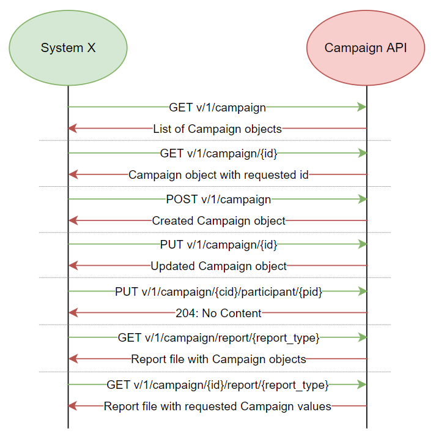
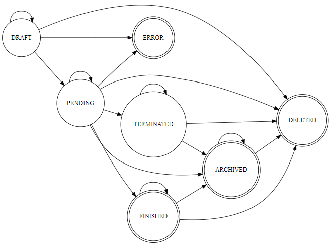
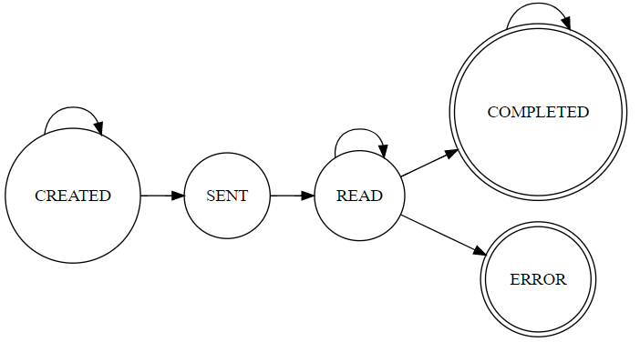

 ViziBit
---
# Campaign API integration

## Includes:
###  - Introduction
###  - Campaign API Calls
###  - Error feedback

---
# Introduction

In order to use requests from this documentation, it is necessary to configure an environment defined with parameters such as gateway host and authorization key.

Here's an example of API structure for an endpoint:

### HTTP Request

`GET {{GATEWAYHOST}}/v/1/campaign`

In order to test requests in a test environment, you can find demonstrational gateway host in the table below. The required authorization key must be requested from Vizibit company. Once given, the authorization key should be written in a header with or without **Bearer** key word or as a **query** parameter (authorization_key) in the testing request.

### Query Parameters

Parameter | Value
--------- | -----------
GATEWAYHOST | https://campaigns-test.signator.hr
**authorization_key** | Your authorization key. Add in a header of request or as **query** parameter.

> Query parameter **authorization_key** can be replaced by filling it's value into header with **Authorization** key.
> 
> Following examples will use authorization as query parameter. 
---
# Campaign API Calls



## Get Campaigns

This endpoint retrieves all campaigns requested by parameters in query.

### HTTP Request

`GET {{GATEWAYHOST}}/v/1/campaign`

### Query Parameters

Parameter | Default | Description
--------- | ------- | -----------
**authorization_key** |  | Indicates the user and his authorities.
page | 1 | Page number whose campaigns will be returned.
perPage | 12 | Maximal number of campaigns returned in each page.


> If successful the above command returns JSON structured like this:

```json
{
  "page": 1,
  "perPage": 12,
  "pages": 4,
  "total": 37,
  "count": 12,
  "type": "Campaign",
  "results": [
    {
      "Id": "",
      "StartedAt": 1636636239,
      "ValidUntil": 1639228239,
      "Name": "New campaign",
      "TransferTemplate": {
        "EN": {
          "Subject": "Email subject",
          "Content": "Text sent in email"
        },
        "DE": {
          "Subject": "...",
          "Content": "..."
        },
        "IT": {
          "Subject": "...",
          "Content": "..."
        },
        "FR": {
          "Subject": "...",
          "Content": "..."
        }
      },
      "Status": "PENDING",
      "Participants": [
        {
          "Id": "...",
          "CampaignId": "...",
          "Status": "SENT",
          "SentAt": 1636636239,
          "TransferLanguage": "IT",
          "TransferType": "EMAIL",
          "TransferIdentifier": "...",
          "ParticipantData": {
            "mobilePhone": "...",
            "clientId": "..."
          },
          "EntityLink": "{{GATEWAYHOST}}/residence?cid=...&pid=...&language=IT"
        }
      ],
      "ParticipantDataRequiredKeys": [],
      "DeliveryAddresses": [
        "..."
      ]
    }
  ]
}
    
```

## Get a Specific Campaign

This endpoint retrieves a specific campaign.

`GET {{GATEWAYHOST}}/v/1/campaign/{id}`

### Route Values
Parameter | Default | Description
--------- | ------- | -----------
id |  | Id of the campaign requested in call.

### Query Parameters

Parameter | Default | Description
--------- | ------- | -----------
**authorization_key** |  | Indicates the user and his authorities.


> If successful the above command returns JSON structured like this:

```json
{
  "Id": "...",
  "StartedAt": 1634821121,
  "ValidUntil": 1637413121,
  "Name": "Test campaign",
  "TransferTemplate": {
    "EN": {
      "Subject": "Email subject",
      "Content": "Text sent in email"
    },
    "DE": {
      "Subject": "...",
      "Content": "..."
    },
    "IT": {
      "Subject": "...",
      "Content": "..."
    },
    "FR": {
      "Subject": "...",
      "Content": "..."
    }
  },
  "Status": "DELETED",
  "Participants": [
    {
      "Id": "...",
      "CampaignId": "...",
      "Status": "READ",
      "TransferLanguage": "EN",
      "TransferType": "EMAIL",
      "TransferIdentifier": "...",
      "ParticipantData": {
        "mobilePhone": "..."
      },
      "EntityLink": "{{GATEWAYHOST}}/residence?cid=...&pid=...&language=EN"
    }
  ],
  "ParticipantDataRequiredKeys": [],
  "DeliveryAddresses": ["..."]
}
```
## Create Campaign

This endpoint creates new campaign filled with required parameters filled in requests body.

In section "Body input" bolded body values are required. 

### HTTP Request

`POST {{GATEWAYHOST}}/v/1/campaign`

### Query Parameters

Parameter | Default | Description
--------- | ------- | -----------
**authorization_key** |  | Indicates the user and his authorities.

### Body input

- **name** - Campaign name
- **transferTemplate** - JSON object with language codes(ISO 639-1) as key and values as objects:
    - **Subject** - Email subject
    - **Content** - Text contained in email
- **Participants** - Array of object with following parameters:
    - **TransferLanguage** - Language code(ISO 639-1) of subject and content send in email, default: EN
    - **TransferIdentifier** - Participants email
    - **TransferType** - Defines means of transmission for otp, currently implemented EMAIL and SMS
    - **ParticipantData** - Object containing data about participant
      - **mobilePhone** - Text of mobile phone number for SMS ie. email where participant gets otp
                    - Means of transmission defined in TransferType
    
    - **status** - "DRAFT" or "PENDING":
      - "DRAFT" - user can still change campaign
      - "PENDING" - user can't change campaign because emails to participants to fill are already been sent
      - other statuses can't be defined at creation of campaign, only when created
- ParticipantDataRequiredKeys - Array of ParticipantData fields expected to be in request
- DeliveryAddresses - Email addresses where campaign changes are sent 

> JSON body request example:

```json
{
  "name": "Test campaign",
  "transferTemplate": {
    "EN": {
      "Subject":"Campaign Test Subject",
      "Content":"Campaign Test Content"
    }
  },
  "Participants": [{
    "TransferLanguage": "EN",
    "TransferType": "EMAIL",
    "TransferIdentifier": "...",
    "ParticipantData": {
      "mobilePhone": "..."
    }
  }],
  "status": "DRAFT"
}
```

> If successful the above command returns JSON structured like this:

```json
{
  "Id": "...",
  "StartedAt": 1638798772,
  "ValidUntil": 1641390772,
  "Name": "Test campaign",
  "TransferTemplate": {
    "EN": {
      "Subject":"Campaign Test Subject",
      "Content":"Campaign Test Content"
    }
  },
  "Status": "DRAFT",
  "Participants": [
    {
      "Id": "...",
      "CampaignId": "...",
      "Status": "CREATED",
      "TransferLanguage": "EN",
      "TransferType": "EMAIL",
      "TransferIdentifier": "...",
      "ParticipantData": {
        "mobilePhone": "..."
      },
      "EntityLink": "{{GATEWAYHOST}}/residence?cid=...&pid=...&language=EN"
    }
  ],
  "ParticipantDataRequiredKeys": [],
  "DeliveryAddresses": []
}
```

## Update Campaign

Main purpose of this endpoint is to allow user to change campaigns **STATUS**.

Except changing status it can change other campaign parameters, but only in campaigns which **STATUS** is **DRAFT**.
It can change one or more parameters included in campaign.


### HTTP Request

`PUT {{GATEWAYHOST}}/v/1/campaign/{id}`

### Route Values
Parameter | Default | Description
--------- | ------- | -----------
id |  | Id of the campaign requested in call.

### Query Parameters

Parameter | Default | Description
--------- | ------- | -----------
**authorization_key** |  | Indicates the user and his authorities.

### Body input

- name - Campaign name
- transferTemplate - JSON object with language key and objects:
  - Subject - Email subject
  - Content - Text contained in email
    
  - status - "DRAFT", "PENDING", "ERROR", "FINISHED", "DELETED", "ARCHIVED", "TERMINATED":
    - "DRAFT" - user can still change campaign
       - can change to "DRAFT", "PENDING", "DELETED", "ERROR"
    - "PENDING" - user can't change campaign because emails are sent to participants
       - can change to "PENDING", "ERROR", "DELETED", "ARCHIVED", "FINISHED", "TERMINATED"
    - "ERROR" - error accrued - final state
    - "FINISHED" - every participant filled form or the duration of the campaign has finished or campaign creator changed status
       - can change to "FINISHED", "DELETED", "ARCHIVED"
    - "ARCHIVED" - admin changed campaign status so it is visible only when asked for



> JSON body request example:

```json
{
  "name": "Test campaign",
  "transferTemplate": {
    "EN": {
      "Subject":"Campaign Test Subject",
      "Content":"Campaign Test Content"
    }
  },
  "Participants": [{
    "TransferLanguage": "EN",
    "TransferType": "EMAIL",
    "TransferIdentifier": "...",
    "ParticipantData": {
      "mobilePhone": "..."
    }
  }],
  "status": "DRAFT"
}
```

> If successful the above command returns JSON structured like this:

```json
{
  "Id": "...",
  "StartedAt": 1638798772,
  "ValidUntil": 1641390772,
  "Name": "Test campaign",
  "TransferTemplate": {
    "EN": {
      "Subject":"Campaign Test Subject",
      "Content":"Campaign Test Content"
    }
  },
  "Status": "DRAFT",
  "Participants": [
    {
      "Id": "...",
      "CampaignId": "...",
      "Status": "CREATED",
      "TransferLanguage": "EN",
      "TransferType": "EMAIL",
      "TransferIdentifier": "...",
      "ParticipantData": {
        "mobilePhone": "..."
      },
      "EntityLink": "{{GATEWAYHOST}}/residence?cid=...&pid=...&language=EN"
    }
  ],
  "ParticipantDataRequiredKeys": [],
  "DeliveryAddresses": []
}
```

## Update Campaign Participant

Purpose of this endpoint is to update participant **STATUS**, but only in campaigns which **STATUS** is **PENDING**

### HTTP Request

`PUT {{GATEWAYHOST}}/v/1/campaign/{id}/participant/{participant_id}`

### Route Values
Parameter | Default | Description
--------- | ------- | -----------
id |  | Id of the campaign requested in call.
participant_id | | Id of participant requested to update.

### Query Parameters

Parameter | Default | Description
--------- | ------- | -----------
**authorization_key** |  | Indicates the user and his authorities.

### Body input

 - status - new participant status
    - "CREATED" - when campaign status is still draft, can change to "CREATED" and "SENT"
    - "SENT" - when campaign admin starts campaign ie. campaign status switched to "PENDING"
        - emails are sent to participants 
        - can change to "READ"
    - "READ" - campaign participant opened link received in email, can open multiple times
        - can change to "READ", "COMPLETED", "ERROR"
    - "COMPLETED" - participant filled form, final state
    - "ERROR" - error occured, final state
  
> JSON body request example:

```json
{
  "status": "COMPLETED"
}
```
> If successfully completed response is 204 No Content



## Get report for Campaigns

This endpoint retrieves report about campaigns requested by parameters in query.

### HTTP Request

`GET {{GATEWAYHOST}}/v/1/campaign/report/{report_type}`

### Route Values
Parameter | Default | Description
--------- | ------- | -----------
report_type |  | Type of report, CSV or XLSX.

### Query Parameters

Parameter | Default | Description
--------- | ------- | -----------
**authorization_key** |  | Indicates the user and his authorities.
page | 1 | Page number whose campaigns will be returned.
perPage | 12 | Maximal number of campaigns returned in each page.

> If successfully completed returns filtered report with campaigns in requested file type.

## Get report for Campaign Participants

This endpoint retrieves report about campaign participants.

### HTTP Request

`GET {{GATEWAYHOST}}/v/1/campaign/{id:guid}/report/{report_type}`

### Route Values
Parameter | Default | Description
--------- | ------- | -----------
report_type |  | Type of report, CSV or XLSX.

### Query Parameters

Parameter | Default | Description
--------- | ------- | -----------
**authorization_key** |  | Indicates the user and his authorities.

> If successfully completed returns filtered report with campaign participants in requested file type.
---
# Error feedback

All errors return the HTTP status code 400, unless an unforeseen situation has occurred. In that case HTTP status code is 500.

All errors are returned as **JSON**.

List of possible errors on Campaign interface

 - 22000 - "Field 'campaignId' missing from request"
 - 22001 - "Field 'participantId' missing from request"
 - 22002 - "Field 'otp' missing from request"
 - 22003 - "No participant with requested 'campaignId' and 'participanId'"
 - 22004 - "Field 'FormData' missing from request"
 - 22005 - "Campaign not found"
 - 22006 - "Campaign participant not found"
 - 22007 - "Unable to update campaign"
 - 22008 - "Created campaign can only be DRAFT or PENDING"
 - 22009 - "Cannot change campaign status from '{1}' to '{0}'"
 - 22010 - "Cannot change campaign participant status from '{1}' to '{0}'"
 - 22011 - "Cannot update non PENDING campaign"
 - 22012 - "Cannot add users with email: {0}"
 - 22013 - "Participant: '{0}', missing some of required data keys: '{1}'"
 - 22014 - "Request body must be defined"
 - 22015 - "Needed at least one participant to start campaign"
 - 22016 - "Participant language not implemented in transfer template"
 - 22017 - "Missing information about entity"
 - 22018 - "Needed at least one transfer template"
 - 22019 - "Participant has already filled the campaign."
 - 22020 - "Participant mobile phone is not defined"
 - 22021 - "Campaign has not yet started"
 - 22022 - "Campaign has finished"
 - 22023 - "Not existing report type."
 - 22024 - "Missing properties for column names."

In case of an error, the processing is interrupted and the error response is returned to the caller.

A more detailed description of the error can be found in the info element.
